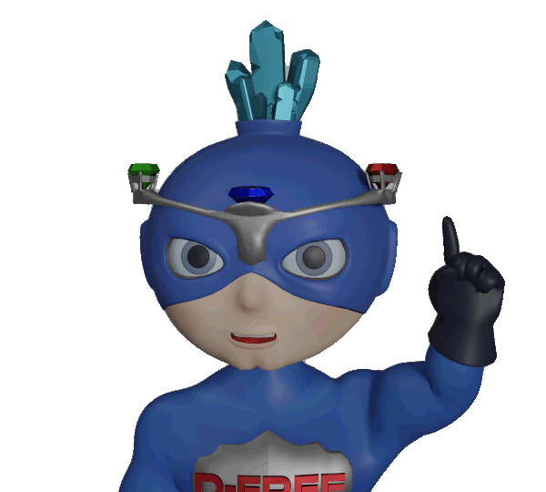

# RYTES Company Style Guide

This document is the source of truth for all branding and style related to RYTES Company. Refer to the definitions, stylizations, colors, images, and patterns listed here whenever creating content for RYTES Company.

## Branding

RYTES Company is our primary brand and is the name that we present to our clients. While there are many other companies that contribute to our product, RYTES Company is front and center. When clients interact with our products, they are expecting to interact with RYTES Company, so our titles, branding, logos, and verbiage should all reflect that.

### Company Name

*Would be good to know where the name of the company comes from. Is the word "Company" redundant? Does RYTES stand for something?*

Always uppercase RYTES. Always capitalize Company. Always a space between the words. Do not refer to it as "The RYTES Company", just "RYTES Company"

```
✔️ RYTES Company
❌ Rytes Company
❌ RYTESCompany
❌ rytes company
❌ The RYTES Company
```

### Company Slogan

<span style="font-variant:small-caps;">Effective Regulatory Navigation</span> should never be in quotes. 

Should always be in a smaller font size than the company name. 

Should always be all caps - small caps where available. 

There should be no period after the slogan.

```
✔️ EFFECTIVE REGULATORY NAVIGATION
❌ EFFECTIVE REGULATORY NAVIGATION.
❌ "EFFECTIVE REGULATORY NAVIGATION"
❌ Effective regulatory navigation
❌ Effective Regulatory Navigation
```

*Alternative slogan suggestions:*

- Navigating regulation the RYTES way
- The RYTE way to navigate regulations
- Know your RYTES

### Product Names

Always uppercase RYTES, and always present the product name as one word. This applies to RYTESite and RYTESInsights.

*Since RYTESite is external, and RYTESInsights is internal, should it be stylized as RYTESInsite?*

## Logo

Never stack the icon and the type. They should always be horizontal. The icon can be used without the type and vice versa. If the type is used without the icon, use text instead of an image.

#### ✔️ Full Logo 


#### ✔️ Standalone Icon


#### ❌ Stacked Icon and Text


*Flag icon to be changed to something that we can actually trademark - current iteration is too close to the American Flag?*

## Colors

#1b10e6<span style="color: transparent">..........................</span>#eb3131<span  style="color: transparent">..........................</span>#f4c141


*These colors are under discussion*

### Dark Mode
My eyes hurt. Wouldn't it be great to have a dark mode available? Or by default? White backgrounds are so abrasive.


## Typography

We should avoid using italics and bold unless absolutely necessary or for specific use cases like titles of media or quotes. Instead of using bold or italics to highlight the important information, consider rephrasing to be more concise and exclude superflous language. See Voice->Simple.

### Font

Text on the web should always be sans-serif (without pen strokes), because sans-serif fonts are more readable on screens. The font we use should also be available by default on Windows and Mac platforms, so we don't need to embed the font files, wait for the user to download, etc. This will allow our communication to maintain a consistent look no matter who views it on any device.

All RYTES Company communication should use the Arial font for body copy.

Titles for pages/sections and headings should always be bolded.

## Voice
RYTESCompany's organizational voice can be described as Authoritative, Simple, and Human. We want to be relatable, knowledgeable, and referencable when we are communicating with our clients. Since clients might rely on our words in a court of law, we need to get things right. We also need to be clear and specific when we say things. We want to avoid any ambiguous statements, and we want clients to feel as if we've got their back. We need to translate obtuse legalese into everyday English, but without losing meaning in the process.

#### Authoritative
Authoritative voice means we know what we're talking about. We are experts on the subject and we are providing accurate information. Authoritative does not mean condescending or aloof - we are here to help, not to talk down to our clients, residents, or their families.

#### Simple
Simple voice means we are sending a message that everyone can understand, whether they are a doctor, a lawyer, or a resident. Simple does not mean juvenile, boring, or vague- we are communicating complex ideas in a way that everyone gets. 

> ❌ They say 90% of good copy-editing is deleting unnecessary text.

> ❌ 90% of good editing is deleting unnecessary text.

> ❌ 90% of good editing is deleting text.

> ✔️ Good editing is deleting.

#### Human
Human voice means that while we are experts, we are people too, and understand what it's like to be in this situation. We are working to find a solution that works for everyone involved, and are here to make sure everyone feels heard.

### Client-facing Voice
When speaking to clients, we want to emphasize the Authoritative and Simple parts of our brand's Voice. We can be a little less human when speaking to clients, because it's all business here.

### Resident-facing Voice
When speaking to residents or their loved ones, we want to emphasize the Simple and Human parts of our brand's Voice. When dealing with complaints from real people, more than anything we just want to be good listeners.


## Writing Style

Always use a single space after a period, and no space before a period.

Always use the Serial/Oxford Comma where applicable. 


## Links and Actions

Never use "Click here" or "Tap here" as the text for an action. This is ambiguous, device-specific, and does not indicate what will happen when the button is used.

### Buttons
For buttons, use the action the button will take- "View Facility", "Sign Up", "Delete Record", "Create Case". If screen space is at a premium, just the verb will do- "View", "Register", "Delete", "Create".

### Links
When an action/verb is not appropriate, use a link instead of a button, with the text representing the name of the target- "Foot Locker", "Federal Guidelines", or "Dashboard". 

## Mascot

*Open Questions- When should we use the mascot? Should we have multiple mascots? Does it dilute the messaging/impact of the character(s)? Where are they most appropriate? Where does it feel like the use of a character lessens the impact of a message?*

### D-Free

 The name D-Free should always be stylized as D-Free. Always capitalize the D and the F, and always put a dash between them.

D-Free as a character has several emotions and poses. D-Free's emotions should generally reflect the content of the message. He's a superhero whose name means Deficiency-Free. If he's at "full power" and happy, that means there's no deficiencies. If he's sad or unhappy, that means there's problems, and the user should take notice. 

### F-Tag

The name F-Tag should always be stylized as F-Tag. Always capitalize the F and the T, and always put a dash between them.

F-Tag as a character is a villain- if they show up, it's a bad sign. Use F-Tag sparingly, and only in situations that need attention. F-Tag stands for Federal Tag, which is when the Federal Government has taken an interest in a facility in a negative way.

## Iconography 

Work in progress. Will probably need a whole separate page to define icons for specific actions/ideas/nouns.

[FontAwesome](https://fontawesome.com/search?m=free&o=r) and [Material Community Icons](https://static.enapter.com/rn/icons/material-community.html) are the frontrunners for icon sets

## Other

## Inspiration for this Guide

- [Bootstrap](https://getbootstrap.com/docs/4.0/about/brand/)
- [Paris 2024](https://www.paris2024.org/en/design/)
- [Spotify](https://developer.spotify.com/documentation/design)
- [Asana](https://asana.com/brand)
- [Walmart](https://walmartbrandcenter.lingoapp.com/s/de9qpe/?v=13)
- [I Love New York](https://issuu.com/lukaszkulakowski/docs/8278452-i-love-new-york-brand-guide)
